# Semantic Segmentation
### Introduction

Semantic segmentation is understanding an image at pixel level i.e, assigning each pixel in the image an object class.In this project, the goal is labeling the pixels of a road in images using a Fully Convolutional Network (FCN).

The goals of this project are the following:

 * Loading Pretrained VGG Model into TensorFlow
 * Creating the layers for a fully convolutional network
 * Building skip-layers using the vgg layers
 * Optimizing the model loss
 * Training model on segmented images (3 classes: background, road, other-road)

## Description

### Available Data

Download the [Kitti Road dataset](http://www.cvlibs.net/datasets/kitti/eval_road.php) from [here](http://www.cvlibs.net/download.php?file=data_road.zip).  Extract the dataset in the `data` folder.  This will create the folder `data_road` with all the training a test images.

### Approach

Current FCN8 implementation follows this [paper](https://people.eecs.berkeley.edu/~jonlong/long_shelhamer_fcn.pdf)

* Encoder: load the vgg model and weights for layers (3,4 & 7)
* Conv1x1: add a convolution filer with kernel_size (1,1) to the last layer to keep spatial information
* Decoder: add 3 upsample layers and skip connections in between to add information from multiple resolutions
* Data processing: 
  * categorization: images & ground truth images are provided in Kitti dataset, ground_truth images should be categorized into 3 classes of background, road & other_road
  * data augmentation: flipping the images also helps adding more data to the training set
* Learning rate: 0.0001
* drop_out: 0.5
* Number of Epochs: 1000
* Batch_size: 16

#### Image Results

Here are the results for 3 models, first model is trained on 1000 epochs without augmentation and only 1 road, 2nd models i trained on 2 roads without augmentation and 500 epochs, and the last model is trained on 2 roads with augmentation and 1000 epochs.

 <table style="width:100%">
  <tr>
    <td>Single Road (1000 epochs without augmentation)</td>
    <td>Multiple Roads (500 epochs without augmentation)</td>
    <td>Multiple Roads (1000 epochs with augmentation)</td>
  </tr>
  <tr>
    <td>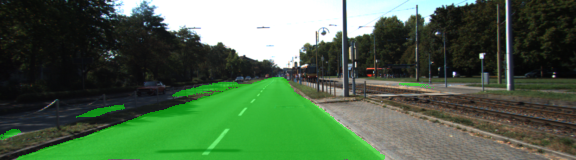</td>
    <td>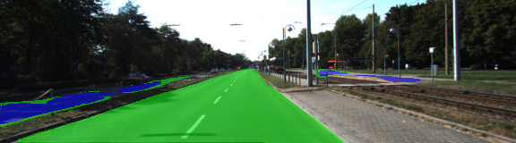</td>
    <td>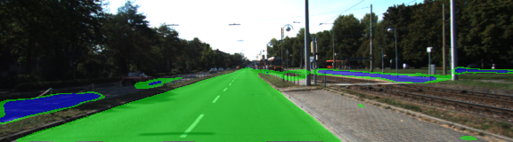</td>
  </tr>
  <tr>
    <td>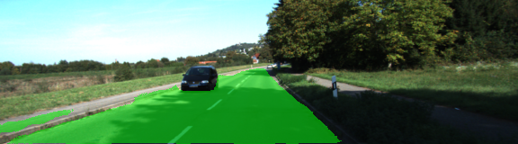</td>
    <td>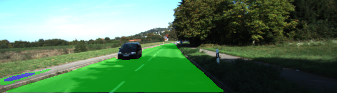</td>
    <td>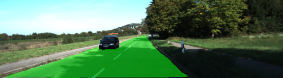</td>
  </tr>
  <tr>
    <td>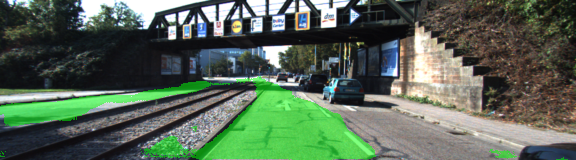</td>
    <td>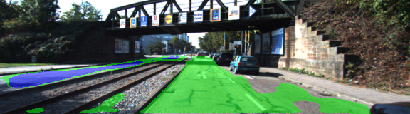</td>
    <td>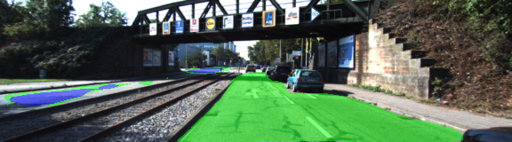</td>
  </tr>
   <tr>
    <td>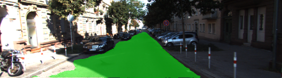</td>
    <td>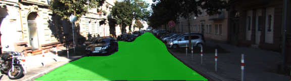</td>
    <td>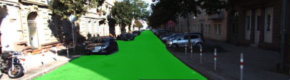</td>
  </tr>
</table>

As shown above training network on 2 roads need more data with more variety of other side of the road, overall all networks performed very good on 500-1000 epochs. Further improvement would require more images and angles, some preprocessing can also improve the results by removing noisy areas from road_detection such as limiting the scope of image to filter sky.

#### Tensorboard Loss

Here is the tensorboard graph for the loss minimization:

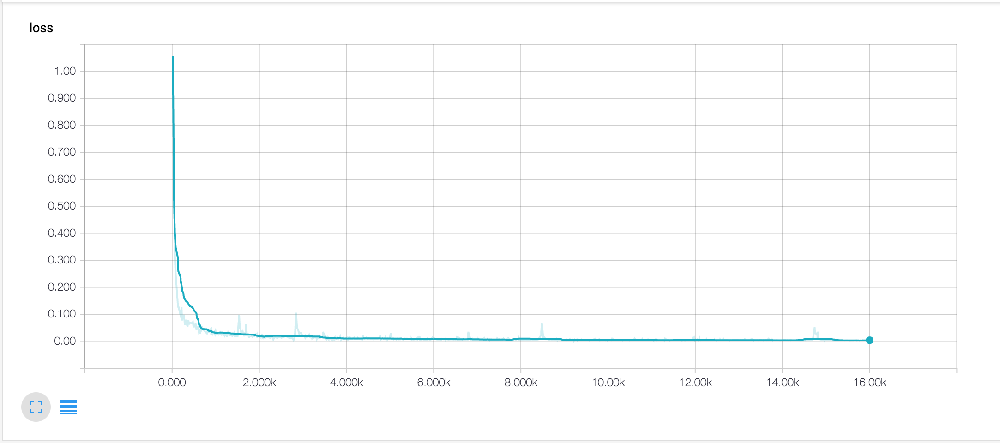

#### Video Result

I save the tensorflow model and loaded it up in my jupyter notebook [experiment.ipynb](https://github.com/chocolateHszd/Semantic-Segmentation/blob/master/experiment.ipynb), model processes each frame individually.

[video output]:(./video/output.mp4)


### Setup
##### Frameworks and Packages
Make sure you have the following is installed:
 - [Python 3](https://www.python.org/)
 - [TensorFlow](https://www.tensorflow.org/)
 - [NumPy](http://www.numpy.org/)
 - [SciPy](https://www.scipy.org/)
 - [Tensorboard](https://www.tensorflow.org/get_started/graph_viz)

### Start

##### Run
Run the following command to run the project:
```
python main.py
```
